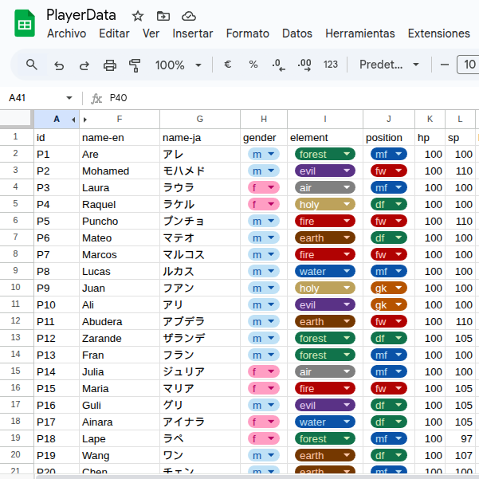
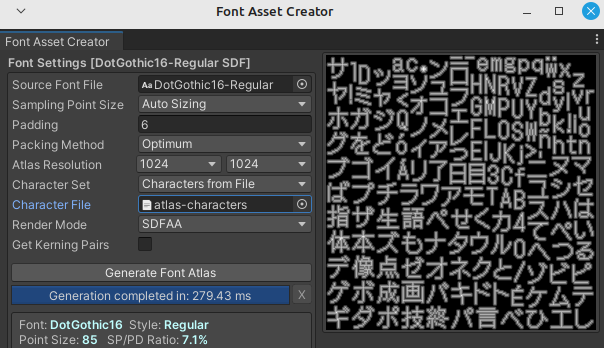

# Soccer Secret 0

**Soccer Secret 0** is a touch-based soccer game for Android, crafted with artificial intelligence and built using the Unity game engine. Enjoy fluid touch controls as you face off against the CPU on your mobile device.

---

## Features

- ⚽ **Touch Gameplay**: Intuitive controls optimized for Android touch screens.
- 🤖 **VS CPU Mode**: Compete against an AI-controlled opponent.
- 🗂 **Google Sheets Integration**: Character parameters are managed using Google Sheets for rapid prototyping and balancing.

---

## Made With AI

- **Code Generation:** GPT-4.1  
- **Image Generation:** DALL·E 3  
- **Music Generation:** [Enzostvs Ai-jukebox](https://huggingface.co/spaces/enzostvs/ai-jukebox)

---

## Changelog

### Version 0.1
- Added touch gameplay
- Added "VS CPU" game mode

---

## How to Play

1. **Install the APK** on your Android device. ([APK](Apk/soccer-secret-0-v0.1.apk))
2. **Touch and drag** on the screen to control your player.
3. **Compete against the CPU** to score goals.

---

## Editing Character Parameters (Development Process)

1. Character parameters are managed using Google Sheets. ([soccer-secret-0-sheets](https://drive.google.com/drive/folders/1zS2bfB3gCjEZeVrcTZ_IQVh1Bky9dpiW?usp=sharing)).
2. By modifying attributes such as speed, control, or learnable secret moves directly within the sheet, the process of editing and balancing stats becomes much more efficient and manageable than traditional manual data entry.
3. The updated data is then exported as a CSV file. 
4. Within the Unity Editor, the Player Importer tool is used to load and apply these parameters to the game.

---

## Localization (Development Process)
This project uses the Unity Localization package and currently supports English and Japanese languages. For Japanese support, the Japanese character atlas is generated automatically using the Atlas Generator tool. The tool scans all text content from the project's String Tables and compiles a texture atlas that includes only the necessary Japanese characters. This process helps optimize both performance and memory usage.

---

## License

This project is licensed under the [GNU General Public License v3.0](https://www.gnu.org/licenses/gpl-3.0.en.html).

---

## Screenshots

Here are some screenshots to give you a taste of the action:

---

> *Soccer Secret 0 – You will survive!*
